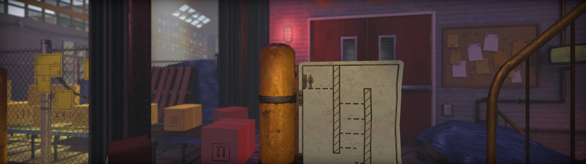

## The Pedestrian ultrawide and wider

The tool removes the side black bars present in the game at 21:9 and wider resolutions. Compared to the manual solution available online, it supports Microsoft Store without file access and does not require enforcing a specific aspect ratio.

1. [Download](/../../releases) and unpack the archive using software like [PeaZip](https://github.com/peazip/PeaZip).
2. Launch the game first, followed by the tool.
3. Press the designated hotkey.
4. If enabled late, go to the game settings and switch between the VSync or Fullscreen modes to ensure proper scaling.

All trainers based on CE components may trigger some anti-virus software.

Tested on the latest Microsoft Store version at 2560x1080, 3840x1080 and 5760x1080.

You can buy me a [coffee](https://ko-fi.com/rozziroxx) or become a [patron](https://www.patreon.com/rozzi).

